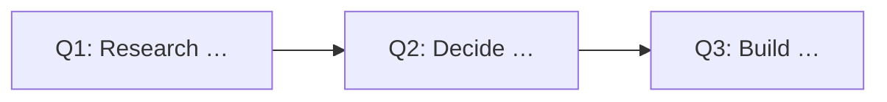

# Ticket templates

## Adventure

```markdown
# <outcome-oriented title>

## Outcome
<What will become possible and for whom.>

## Scope
- <included capability>

## Out of scope
- <explicit exclusion>

## Shared understanding
- <accepted product or technical constraint>

## Quest graph


## Quests
- [ ] <Quest reference and title>
```

## Quest

```markdown
# <verb-first title>

## Adventure
<parent reference>

## Type
<research | prototype | decision | architecture | task | fetch>

## Description
<One bounded unit of work and why it matters.>

## Outcome
<Observable result this Quest must produce.>

## Constraints
- <constraint>

## Dependencies
- <Quest reference, or None>

## Proof
<Required application behaviors to demonstrate, or `Not required` for a non-application outcome.>

## Discoveries
<Added during execution.>
```

## Ticket quality

A Quest is ready when its outcome is observable, its dependencies are explicit, and a fresh session can execute it without relying on conversation history. Later Quests may remain high-level when an earlier Research, Prototype, Decision, or Architecture Quest is expected to refine them.
